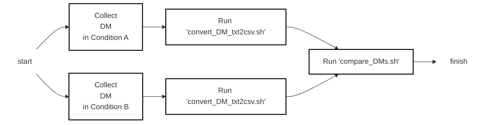

# Readme

Author: Terry Yu

Brief: Analyze RDK-B Data Model (DM) based on each component


[toc]


## Workflow

The steps of workflow shows below:

1. Collect Data Model (DM)

2. Run 'convert_DM_txt2csv.sh'

   - Divide DM data into component data. ( e.g. `wifi`, `lmlite`, and so on )
   - Transform to CSV format.

3. Run 'compare_DMs.sh'

   - Pick intersection components between two DMs.
   - Compare intersection components between two DMs.


The workflow diagram shows below:





Please see details by following section [demo](##Demo)


## Demo

Collect "prepare" DM, "online" DM, and "offline" DM

```bash
.
├── data/
│   ├── offline/
│   │   └── offline_DM.txt
│   ├── online/
│   │   └── online_DM.txt
│   └── prepare/
│       └── prepare_DM.txt
├── script/
│   ├── compare_DMs.sh
│   └── convert_DM_txt2csv.sh
└── readme.md

5 directories, 6 files
```


Run "convert_DM_txt2csv.sh" to each "{condition}_DM.txt"

```bash
.
├── data/
│   ├── offline/
│   │   ├── DM_component_CSVs/				# `bash convert_DM_txt2csv.sh ./data/offline/offline_DM.txt`
│   │   │   ├── arcaccountmngr.csv
│   │   │   ├── arcwancontrol.csv
│   │   │   ├── ccspik41agent.csv
│   │   │   ├── dlnacomponent.csv
│   │   │   ├── ethagent.csv
│   │   │   ├── ftpcomponent.csv
│   │   │   ├── led.csv
│   │   │   ├── lmlite.csv
│   │   │   ├── logagent.csv
│   │   │   ├── notifycomponent.csv
│   │   │   ├── pppmanager.csv
│   │   │   ├── sambacomponent.csv
│   │   │   ├── stateinfomanager.csv
│   │   │   ├── tdm.csv
│   │   │   ├── telcovoicemanager.csv
│   │   │   ├── tr069pa.csv
│   │   │   ├── vlanmanager.csv
│   │   │   ├── wanmanager.csv
│   │   │   ├── wifi.csv
│   │   │   └── xdslmanager.csv
│   │   └── offline_DM.txt
│   ├── online/								# `bash convert_DM_txt2csv.sh ./data/online/online_DM.txt`
│   │   ├── DM_component_CSVs/
│   │   │   ├── arcaccountmngr.csv
│   │   │   ├── arcwancontrol.csv
│   │   │   ├── ccspik41agent.csv
│   │   │   ├── dlnacomponent.csv
│   │   │   ├── ethagent.csv
│   │   │   ├── ftpcomponent.csv
│   │   │   ├── led.csv
│   │   │   ├── lmlite.csv
│   │   │   ├── logagent.csv
│   │   │   ├── notifycomponent.csv
│   │   │   ├── pam.csv
│   │   │   ├── pppmanager.csv
│   │   │   ├── sambacomponent.csv
│   │   │   ├── stateinfomanager.csv
│   │   │   ├── tdm.csv
│   │   │   ├── telcovoicemanager.csv
│   │   │   ├── tr069pa.csv
│   │   │   ├── vlanmanager.csv
│   │   │   ├── wanmanager.csv
│   │   │   ├── wifi.csv
│   │   │   └── xdslmanager.csv
│   │   └── online_DM.txt
│   └── prepare/							# `bash convert_DM_txt2csv.sh ./data/prepare/prepare_DM.txt`
│       ├── DM_component_CSVs/
│       │   ├── arcaccountmngr.csv
│       │   ├── arcwancontrol.csv
│       │   ├── ccspik41agent.csv
│       │   ├── dlnacomponent.csv
│       │   ├── ethagent.csv
│       │   ├── ftpcomponent.csv
│       │   ├── led.csv
│       │   ├── lmlite.csv
│       │   ├── logagent.csv
│       │   ├── notifycomponent.csv
│       │   ├── pam.csv
│       │   ├── pppmanager.csv
│       │   ├── sambacomponent.csv
│       │   ├── stateinfomanager.csv
│       │   ├── tdm.csv
│       │   ├── telcovoicemanager.csv
│       │   ├── tr069pa.csv
│       │   ├── vlanmanager.csv
│       │   ├── wanmanager.csv
│       │   ├── wifi.csv
│       │   └── xdslmanager.csv
│       └── prepare_DM.txt
├── script/
│   ├── compare_DMs.sh
│   └── convert_DM_txt2csv.sh
└── readme.md

8 directories, 68 files
```


Run `compare_DMs.sh` at online DM and offline DM

```bash
.
├── DM_comparison/		# `bash compare_DMs.sh ./data/online/DM_component_CSVs ./data/online/DM_component_CSVs`
│   └── online_offline/	# show which two DMs
│       ├── commom/		# compare only intersection components between two DMs
│       │   ├── arcaccountmngr.csv
│       │   ├── arcwancontrol.csv
│       │   ├── ccspik41agent.csv
│       │   ├── dlnacomponent.csv
│       │   ├── ethagent.csv
│       │   ├── ftpcomponent.csv
│       │   ├── led.csv
│       │   ├── lmlite.csv
│       │   ├── logagent.csv
│       │   ├── notifycomponent.csv
│       │   ├── pppmanager.csv
│       │   ├── sambacomponent.csv
│       │   ├── stateinfomanager.csv
│       │   ├── tdm.csv
│       │   ├── telcovoicemanager.csv
│       │   ├── tr069pa.csv
│       │   ├── vlanmanager.csv
│       │   ├── wanmanager.csv
│       │   ├── wifi.csv
│       │   └── xdslmanager.csv
│       └── component_list.csv	# show two DMs components
├── data/
│   ├── offline/
│   │   ├── DM_component_CSVs/
│   │   │   ├── arcaccountmngr.csv
│   │   │   ├── arcwancontrol.csv
│   │   │   ├── ccspik41agent.csv
│   │   │   ├── dlnacomponent.csv
│   │   │   ├── ethagent.csv
│   │   │   ├── ftpcomponent.csv
│   │   │   ├── led.csv
│   │   │   ├── lmlite.csv
│   │   │   ├── logagent.csv
│   │   │   ├── notifycomponent.csv
│   │   │   ├── pppmanager.csv
│   │   │   ├── sambacomponent.csv
│   │   │   ├── stateinfomanager.csv
│   │   │   ├── tdm.csv
│   │   │   ├── telcovoicemanager.csv
│   │   │   ├── tr069pa.csv
│   │   │   ├── vlanmanager.csv
│   │   │   ├── wanmanager.csv
│   │   │   ├── wifi.csv
│   │   │   └── xdslmanager.csv
│   │   └── offline_DM.txt
│   ├── online/
│   │   ├── DM_component_CSVs/
│   │   │   ├── arcaccountmngr.csv
│   │   │   ├── arcwancontrol.csv
│   │   │   ├── ccspik41agent.csv
│   │   │   ├── dlnacomponent.csv
│   │   │   ├── ethagent.csv
│   │   │   ├── ftpcomponent.csv
│   │   │   ├── led.csv
│   │   │   ├── lmlite.csv
│   │   │   ├── logagent.csv
│   │   │   ├── notifycomponent.csv
│   │   │   ├── pam.csv
│   │   │   ├── pppmanager.csv
│   │   │   ├── sambacomponent.csv
│   │   │   ├── stateinfomanager.csv
│   │   │   ├── tdm.csv
│   │   │   ├── telcovoicemanager.csv
│   │   │   ├── tr069pa.csv
│   │   │   ├── vlanmanager.csv
│   │   │   ├── wanmanager.csv
│   │   │   ├── wifi.csv
│   │   │   └── xdslmanager.csv
│   │   └── online_DM.txt
│   └── prepare/
│       ├── DM_component_CSVs/
│       │   ├── arcaccountmngr.csv
│       │   ├── arcwancontrol.csv
│       │   ├── ccspik41agent.csv
│       │   ├── dlnacomponent.csv
│       │   ├── ethagent.csv
│       │   ├── ftpcomponent.csv
│       │   ├── led.csv
│       │   ├── lmlite.csv
│       │   ├── logagent.csv
│       │   ├── notifycomponent.csv
│       │   ├── pam.csv
│       │   ├── pppmanager.csv
│       │   ├── sambacomponent.csv
│       │   ├── stateinfomanager.csv
│       │   ├── tdm.csv
│       │   ├── telcovoicemanager.csv
│       │   ├── tr069pa.csv
│       │   ├── vlanmanager.csv
│       │   ├── wanmanager.csv
│       │   ├── wifi.csv
│       │   └── xdslmanager.csv
│       └── prepare_DM.txt
├── script/
│   ├── compare_DMs.sh
│   └── convert_DM_txt2csv.sh
└── readme.md

11 directories, 89 files
```

